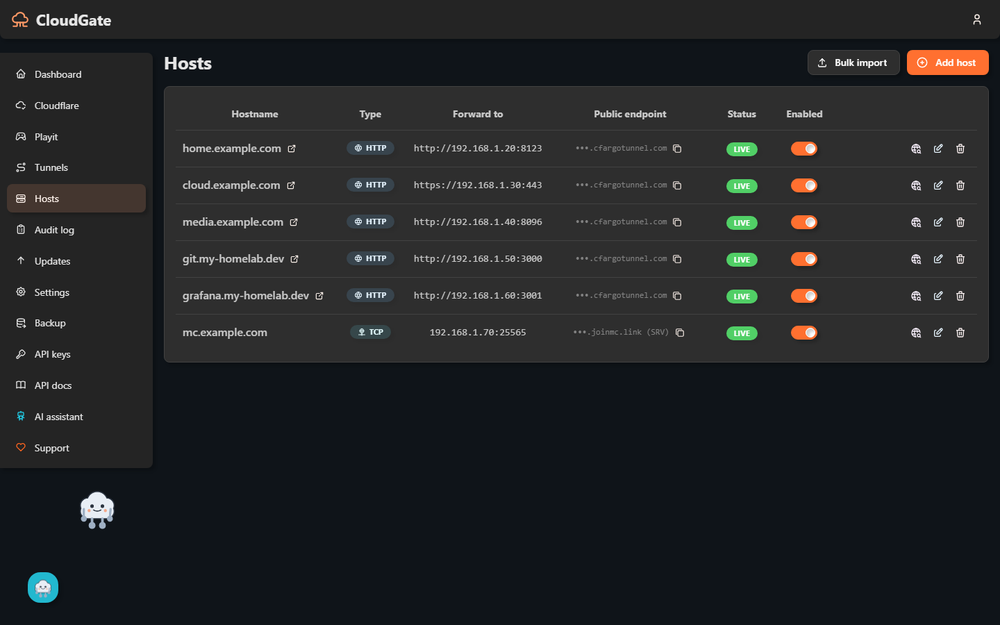

# 🌩️ CloudGate

> **Self-hosted WebUI for Cloudflare Tunnels and playit.gg.** Host services from behind CGNAT without port forwarding — Immich, Nextcloud, Jellyfin, Proxmox, Home Assistant, you name it.

**Status:** stable — current release v0.6.0.



[](LICENSE)
[](https://github.com/Elias02345/CloudGate/actions/workflows/ci.yml)
[](SPONSORING.md)

---

## Why CloudGate?

Many home internet connections (especially in Germany — 1&1, Vodafone Cable, mobile) sit behind **CGNAT** or DS-Lite. You have no public IPv4, no port forwarding, and tools like [Nginx Proxy Manager](https://github.com/NginxProxyManager/nginx-proxy-manager) simply don't work.

**Cloudflare Tunnel** solves this — for free — but the setup (`cloudflared login`, `tunnel create`, `route dns`, manage `config.yml`, run the daemon) is a hard wall for non-sysadmins.

**CloudGate** is a WebUI that does it all:
- Add a service: enter `192.168.1.42:8080` and `immich.yourdomain.com` → done.
- CloudGate creates the Cloudflare Tunnel, DNS record, ingress rule, and reloads `cloudflared`.
- Need raw TCP/UDP instead of HTTP — a Minecraft server, SSH, a game server? [Playit.gg](https://playit.gg) tunnels handle that (Cloudflare's free tier can't).
- Hybrid mode: per host, pick **"via Cloudflare Tunnel"** OR **"local nginx reverse proxy"**.
- Self-updates when new releases ship on a standalone install — never overwrites your data. On an app-store install, the platform updates the image instead (see [Install from an app store](#install-from-an-app-store)).

> **Not affiliated with Cloudflare or Playit.gg.** CloudGate uses their public, documented APIs.

---

## Quick Start

### Option A — One-liner (Ubuntu / Debian / LXC / Proxmox)

Fresh Ubuntu container, no prior setup:

```bash
bash -c "$(curl -fsSL https://raw.githubusercontent.com/Elias02345/CloudGate/main/install/lxc-install.sh)"
```

The installer:
- Installs Docker if missing
- Pulls the latest CloudGate image (falls back to building from source)
- Creates a persistent data volume
- Starts the container and waits for it to become healthy
- Prints the URL to open and create your admin account

**Re-runnable** — running it again won't wipe your data.

> **Proxmox LXC users**: enable `nesting=1,keyctl=1` in the container's features config.
> Use an Ubuntu 24.04 template, 2 cores, 1 GB RAM, 4 GB disk minimum.

### Option B — Plain Docker

If you already have Docker:

```bash
docker run -d --name cloudgate \
  -p 80:80 -p 443:443 \
  -v cloudgate-data:/data \
  --restart unless-stopped \
  ghcr.io/elias02345/cloudgate:latest
```

> The admin UI/API is also served on port **8080** (`-p 8080:8080`) — the port
> app-store platforms (Umbrel, TrueNAS, Unraid, ZimaOS) publish on their own.
> 80/443 are only needed if you use CloudGate's local-nginx reverse-proxy mode.

### What happens next

1. Open `http://<your-host-ip>/` (or port `8080`) in a browser.
2. The first thing you'll see is **Create your admin account** — pick your own email, name and password. This page only works once, only from your local network, and only for a short time after the container starts (30 minutes by default; restart the container to reopen it).
3. You're logged in immediately — no forced password change, no digging a generated password out of the logs.
4. Add your Cloudflare API token in the UI (instructions: see [`docs/CLOUDFLARE_SETUP.md`](docs/CLOUDFLARE_SETUP.md)).
5. Create your first tunnel, add a host — services live within ~30 seconds.

> **Headless / scripted installs**: set `CLOUDGATE_INITIAL_ADMIN_PASSWORD` (and optionally `CLOUDGATE_INITIAL_ADMIN_EMAIL`) before first boot to create the admin account automatically instead of using the Setup page — see [`.env.example`](.env.example).

That's it. CloudGate manages keys, secrets, and updates automatically.

### Install from an app store

Packages for **Unraid, TrueNAS, Umbrel and ZimaOS** are prepared in [`packaging/`](packaging/) and listings are pending review with each store — CloudGate isn't listed in any app store yet. Once accepted, an app-store install publishes only the admin port and leaves updates to the platform (`CLOUDGATE_DISABLE_UPDATES=true`); see [`docs/STORE_PUBLISHING.md`](docs/STORE_PUBLISHING.md) for details.

---

## Features

| Category | Capability |
|---|---|
| **Install** | One-liner installer for Ubuntu/LXC · Plain `docker run` · Multi-arch GHCR images · app-store packages pending review |
| **Bootstrap** | Auto-generated encryption key, JWT secret, admin password — zero env vars required |
| **Cloudflare** | API-token auth · multi-account · automatic zone sync · token revocation cleanup |
| **Tunnels** | Create, restart, delete · live status · log tail · auto-revive on container restart · SIGHUP reload |
| **Playit.gg** | Raw TCP/UDP tunnels for Minecraft (Java + Bedrock), SSH and other non-HTTP services |
| **Hosts (Cloudflare mode)** | DNS CNAME auto-create · tunnel-config rewrite · HEAD-probe test · enable/disable toggle |
| **Hosts (local nginx mode)** | Per-host conf with `nginx -t` validation · Let's Encrypt via DNS-01 · auto-renewal cron |
| **Security** | Argon2id passwords · AES-256-GCM token encryption · 2FA TOTP · per-route rate limiting · audit log |
| **Self-update** | 6h GitHub polling · mandatory SHA256 verification · atomic in-place install with auto-rollback (standalone installs only — app-store installs are updated by the platform) |
| **Resilience** | Recovery UI fallback (no blank pages) · DB snapshots per update · sacred-path persistence contract |
| **UX** | i18n DE+EN · light/dark theme · live dashboard · SSE-driven cache invalidation |

## Architecture

```
┌────────────────────────────────────────────────────────────────┐
│  Browser ──http→ nginx :8080 (and :80) ──┬─→ React SPA (static) │
│                                          └─→ /api → backend :3000│
└────────────────────────────────────────────────────────────────┘
                                  │
        ┌─────────────────────────┴───────────────────────────┐
        │  CloudGate container (s6-overlay supervised)        │
        │                                                     │
        │  bootstrap (oneshot, idempotent) ─► success ─► main │
        │                                  └─► failure ─► recovery-ui
        │                                                     │
        │  backend  ┌──► spawns cloudflared ──tunnels──→ CF   │
        │           ├──► spawns playit-agent ──tunnels──→ Playit.gg
        │           ├──► writes /data/cloudflared/config.yml  │
        │           ├──► writes /data/nginx/hosts/*.conf      │
        │           ├──► self-updater (GitHub polling)        │
        │           └──► ACME cert renewal cron               │
        └─────────────────────────────────────────────────────┘
                                  │
              ┌───────────────────┴───────────────────┐
              │  /data volume — sacred                 │
              │  secrets/  db/  cloudflared/  playit/  │
              │  nginx/{hosts,certs,custom}  logs/     │
              │  updates/{staging,backups}             │
              │                                        │
              │  NEVER overwritten by updates          │
              │  (see CLAUDE.md §1)                    │
              └────────────────────────────────────────┘
```

## Documentation

- [`CLAUDE.md`](CLAUDE.md) — rules for contributors (and AI assistants) on writing updates that don't break user data
- [`docs/ARCHITECTURE.md`](docs/ARCHITECTURE.md) — system design overview
- [`docs/UPDATE_RULES.md`](docs/UPDATE_RULES.md) — detailed update-safety rules
- [`docs/CLOUDFLARE_SETUP.md`](docs/CLOUDFLARE_SETUP.md) — how to create the Cloudflare API token
- [`docs/HOME-ASSISTANT.md`](docs/HOME-ASSISTANT.md) — fixing Home Assistant's "400: Bad Request" behind a tunnel
- [`docs/STORE_PUBLISHING.md`](docs/STORE_PUBLISHING.md) — how CloudGate reaches homelab app stores
- [`docs/AGENT.md`](docs/AGENT.md) — API keys and REST recipes for scripting/AI-agent use

---

## Branch Strategy

- `main` — release-only. Tagged versions `v0.x.y` trigger GitHub Releases + GHCR image builds.
- `dev` — active development. All feature work goes here first.
- Feature branches → PR into `dev` → CI must pass.
- Periodic merges `dev → main` produce releases.

---

## Contributing

PRs welcome. Read [`CLAUDE.md`](CLAUDE.md) first — especially the persistence and migration rules.
See [`docs/CONTRIBUTING.md`](docs/CONTRIBUTING.md) for the dev workflow.

## 💛 Support

CloudGate is free forever (MIT) and maintained by a single developer in their spare time. If it saves you a Sunday afternoon, a small tip helps cover infrastructure + signing keys + ongoing dev time:

- ☕ [**PayPal**](https://www.paypal.me/EliasK09) — one-click
- ₿ Bitcoin: `bc1qphk3h7sw6j429c62ypw6zxgmkfeevmxs437ze3`
- ⟠ Ethereum: `0x81deF905D66fd17433003e749f1e69bCFd95664d`
- ◎ Solana: `G362aMnx7jSXp4iWtCwyw2yXy52ukRVoFgYCpw4aqrPQ`

The running app has all of these as scannable QR codes in **Sidebar → Support**.
Full details in [SPONSORING.md](SPONSORING.md).

Can't donate? Starring the repo and reporting bugs are equally helpful.

## License

[MIT](LICENSE)
